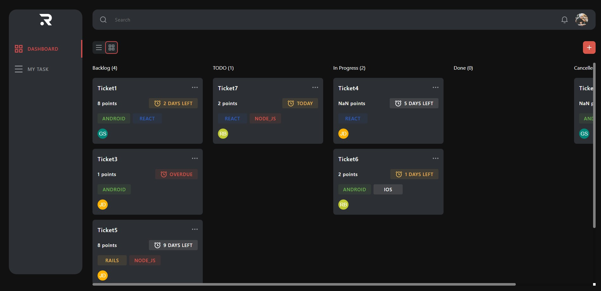

# Ravn React Code Challengue

Dashboard with the habilities to check, create, update and delete Tasks.



Live Demo [aquí](https://alrus-ravn-challengue.onrender.com/).

## Setup/Running instructions

In order to run this project, you should run:

### `npm install`

To install all the dependences, then you should create a .env file in the root folder with the following variables:

```
REACT_APP_GRAPHQL_TOKEN
```

You can use the `.env.copy` file as a template.

Then you can run:

### `npm start`

To launch the app in development mode.

## Project structure

```
src
├───assets
│   └───icons
├───components
│   ├───searchbar
|   |   ├───SearchBar.tsx
|   |   └───SearchBar.scss
│   ├───sidebar
│   ├───tag
│   ├───taskcard
│   ├───taskcolumn
│   └───topbar
├───interfaces
├───queries
├───styles
├───utils
└───views
    ├───dashboard
    └───tasklist
```
The project is divided in 7 main folders:

- **assets**: Contains images and icons.
- **components**: Contains all the react components and the styles used by them, each one in its own folder.
- **interfaces**: Contains all the interfaces, types and enums used in the project.
- **queries**: Contains graphQL queries.
- **styles**: Contains global styles.
- **utils**: Contains functions to process data (transform tasks structure, map values into anothers, etc.).
- **views**: Contains the main views of the app (Dashboard and Tasklist).

## Technologies
This project was created with the following technologies:
- React
- Typescript
- Apollo Client
- GraphQL
- React Router
- SCSS
